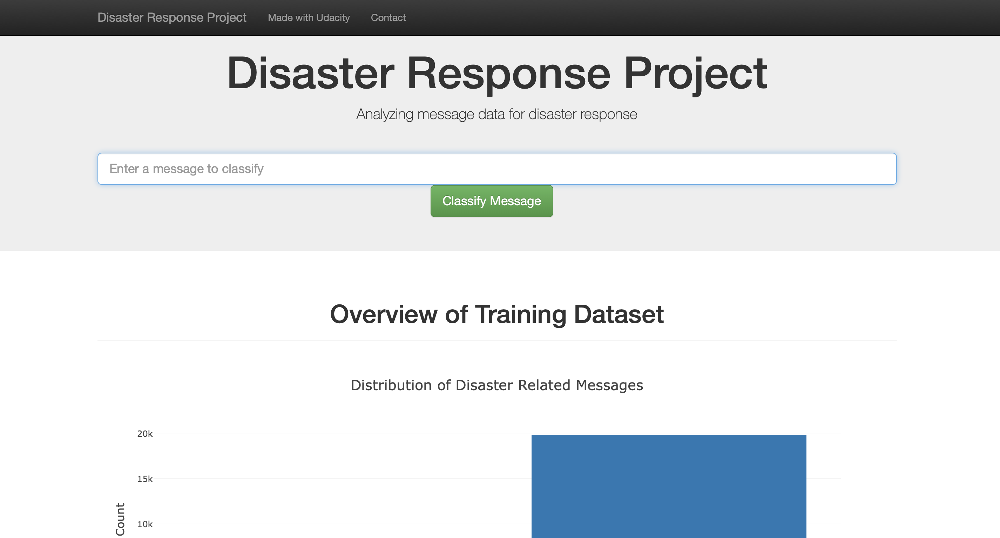
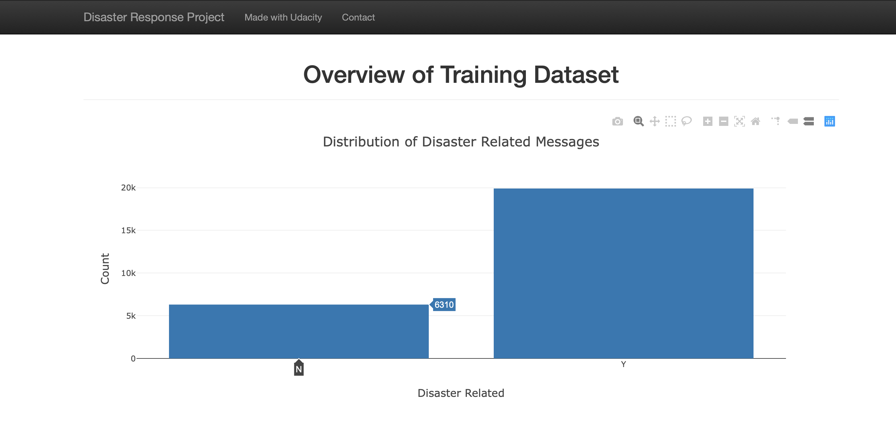
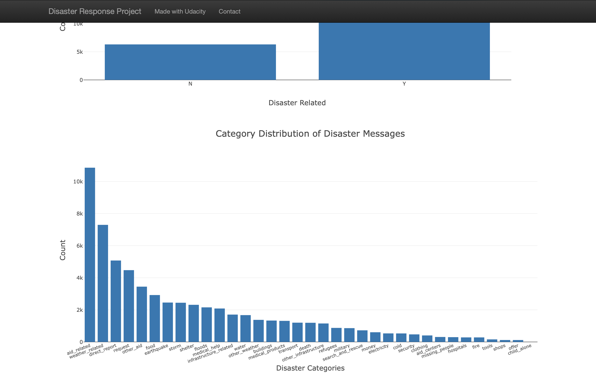
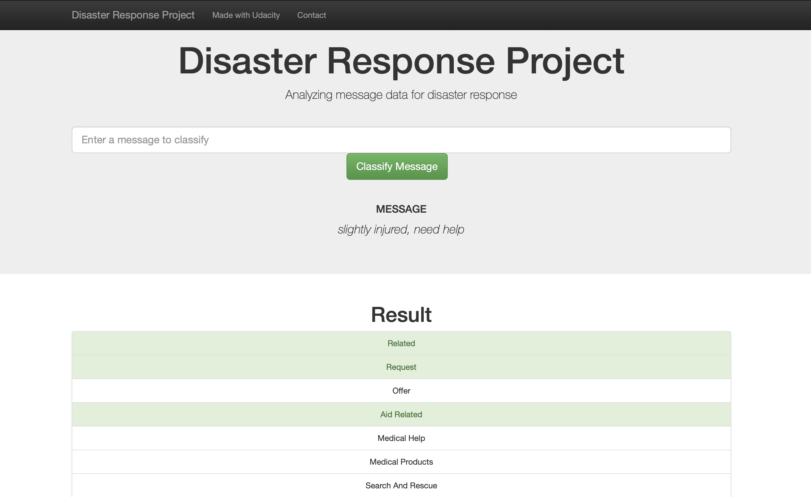

# Disaster-Response-Pipeline
This project is about building a disaster response ETL and Machine Learning
pipelines to process disaster messages and categorize their events type.
In this way, each message could be sent to an appropriate disaster relief agency.
Also, a disaster response web app was built to allow emergency worker to input
messages and get the predicted classification category results.

This project is from Udacity Data Science Nano-Degree and data comes from
[Figure Eight](https://www.figure-eight.com).

## Project Outline

This project mainly includes 3 parts:
* ETL Pipeline
* Machine Learning Pipeline
* Web App

### **1**. **ETL Pipeline**
This part will process disaster message and the correlated categories data,
then merge them together and store clean data into a SQLite database.

**code: data/process_data.py**  
**data: data/disater_messages.csv, data/disaster_categories.csv**

**At master folder terminal run:** (Modify the database name as you want, but keep the files' sequence) 
python data/process_data.py data/disaster_messages.csv data/disaster_categories.csv data/DisasterResponse.db  

You will get cleaned dataset stored at data/DisasterResponse.db  

### **2**. **Machine Learning Pipeline**
This part will utilize cleaned disaster messages as the predictor and 36 kinds  
of categories as the targets to train and test a multiple outputs classifier.

Detailed functions include:  
* Load data from SQLite database which stored in the ETL Pipeline step.
* Text processing and machine leaning piplines.
  Text processing on disaster messages, which include normalization, tokenization,
  lemmatization and tf-idf transformation.
  GridSearchCV training included.
* Test prediction results on test dataset and output performance report.
* Save model into pickle file which will be used in the web app.

**code: model/train_classifier.py**  
**data: data/DisasterResponse.db**  

**At master folder terminal run:**(Modify the classifier's name as you want, but keep the files' sequence)  
python model/train_classifier.py data/DisasterResponse.db model/classifier.pkl  

You will get trained classifier stored at model/classifier.pkl  

### **3**. **Web App**
This part will create a flask web app to visualize some data distributions of disaster
messages and categories. Also, it allows input messages and get the predicted
classification category results.   

**code: app/run.py**  
**data: data/DisasterResponse.db**  
**HTML Templates: templates/master.html, templates/go.html**  

Modify files names and paths of database which was get from ETL pipeline step and the  
classifier pickle file which was get from 2nd step.  

At udacity workspace master folder terminal run:  
python app/run.py  
Then open another terminal to type env | grep WORK   

Replace SPACEID and SPACEDOMAIN into below link  
https://SPACEID-3001.SPACEDOMAIN

Then you will get the web app link and open it with browser.

## Required packages
Besides regular pre-install packages, you need below packages to run this project:  

Flask==1.0.2  
plotly==3.6.1  
nltk==3.4  
scikit-learn==0.20.1  
sqlalchemy==1.2.15  

In udacity workspace python:
`import nltk`
`nltk.download('stopwords')`

## Screenshots of Web App

####           Main Page

####           Charts

####         Predicted Ctegories

